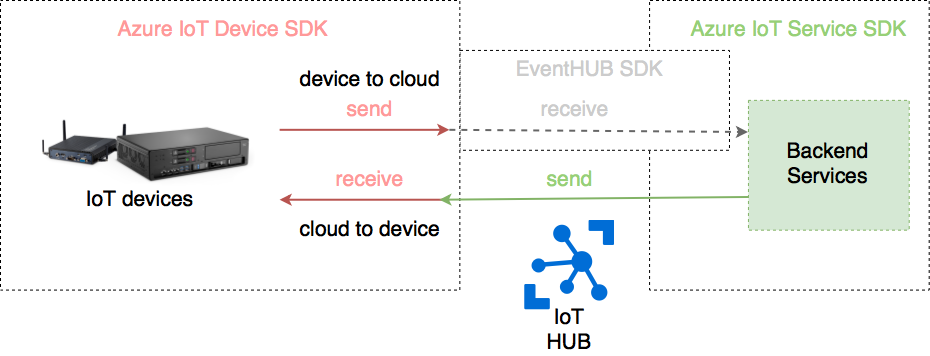

#Introduction

Note : work in progress. Samples need to be made more clear. 

Samples were taken from the [Azure IoT SDK for Java repo](https://github.com/Azure/azure-iot-sdk-java)
and reworked.

Goal is to offer a set of samples for the different messaging scenarios in Azure IoT.

# Device perspective.

A device wants to send data to IoT HUB (ex: sensor data) and receive data from IT HUB (commands).

## DeviceToCloudSender

Sample code for a device that needs to send data to Azure IoT HUB.
Uses the Azure IOT Device SDK and the `DeviceClient` to send messages to IoT HUB.

## CloudToDeviceReceiver

Sample code for a device that needs to receive data from Azure IoT HUB.
Uses the Azure IOT Device SDK and the `MessageCallback ` to receive messages.

Note : If a device needs to send and receive it needs to do this over the same connection, as 1 deviceID cannot use mutiple connections to IoT hub.

# Cloud

From the cloud, you typically want to send data to a device, and receive data from a device.

## CloudToDeviceSender

Sample code for a backend service that needs to send data to a device.
Uses the Azure IoT Service SDK and the `ServiceClient` to send messages to a device.

## DeviceToCloudReceiver

